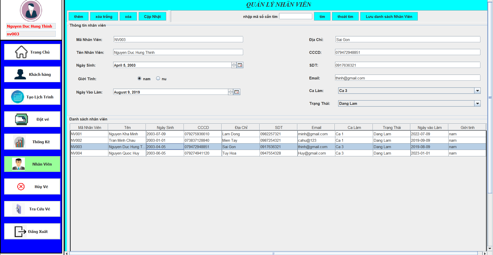
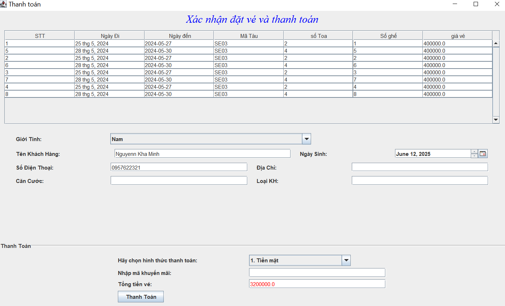

# 🚆 Java Swing Railway Booking System

**Railway Booking System** is a desktop application built using **Java Swing** that provides a full-featured **train ticket booking system**. The application is designed for **employee use**, featuring login authentication, customer and employee information management, ticket operations (booking, canceling, viewing), revenue statistics, and train schedule creation. The application's interface and user interactions are fully in **Vietnamese**.

---

## 🌟 Main Features

### **Login System**

* Employee-only login to access the system.
* Authenticates user credentials securely.

### **Customer Management**

* Add, edit, and view customer information.
* Store personal details and booking history.

### **Employee Management**

* Add, edit, and view employee profiles.
* Tracks which employee performed each action (e.g., who sold the ticket).

### **Ticket Booking**

* Supports **one-way** and **round-trip** ticket bookings.
* Users can select:

  * Departure and arrival stations
  * Departure and return dates (for round-trip)
  * Trip type (one-way or two-way)

* The system automatically finds and displays all suitable trains based on the selected criteria.
* Ticket price is calculated and displayed before final confirmation.

### **Customer Booking Lookup**

* Retrieve detailed booking information for any customer.
* Displays:

  * Trip type (one-way or round-trip)
  * Departure and arrival details
  * Travel schedule
  * Booking date
  * Assigned employee who processed the booking

### **Ticket Cancellation**

* Allows ticket cancellations with a partial refund.
* Cancellation is only permitted if made **more than 24 hours before departure**.
* Refund amount is determined by the time remaining until departure.
* The refundable amount is automatically calculated and displayed prior to confirmation.

### **Statistics**

* Track revenue with filters by:

  * Date
  * Invoice
* Show insights including:

  * Total tickets sold
  * Revenue generated
  * Detailed breakdown of ticket sales by employee

### **Train Schedule Management**

* Create and manage train schedules.
* Enter schedule details including:

  * Train number
  * Departure and arrival station
  * Departure and arrival date
  * Ticket Price

---

## 🖥️ Interface Overview

### Login Screen


### Home Screen  


### Customer Management


### Employee Management


### Ticket Booking


### Payment Details


### Booking Lookup  


### Ticket Cancellation


### Revenue Statistics


### Train Schedule Management


---

## 🗂️ Project Structure

```
src/
│
├── connectDB/         # Contains the setup for connecting to the database
├── dao/               # Handles database operations and data access
├── entity/            # Defines the data models used in the application
└── gui/               # Includes all the user interface components and screens
```

---

## 🧪 Test Coverage

* Authentication and login functionality
* Ticket booking and cancellation workflows
* Schedule validation, including date and time consistency
* Revenue reporting by date and invoice
* Handling of errors and invalid operations

---

## 🚨 Validation & Exception Handling

* Blocks bookings and cancellations with invalid dates or times.
* Disallows ticket cancellations within 24 hours of departure.
* Validates all user inputs, including dates, form fields, and login credentials.
* Provides clear, user-friendly error messages in the interface.

---

## 🛠️ Technologies Used

* **Java SE 17+**  
* **Java Swing**  
* **JUnit 5**  
* **Eclipse IDE**
* **Microsoft SQL Server**

---

## 🚀 Future Enhancements

* Exporting receipts/invoices as PDF
* Role-based access (Admin vs Regular employee)
* Integrating with real-time train APIs
* Dark mode / modern UI themes
